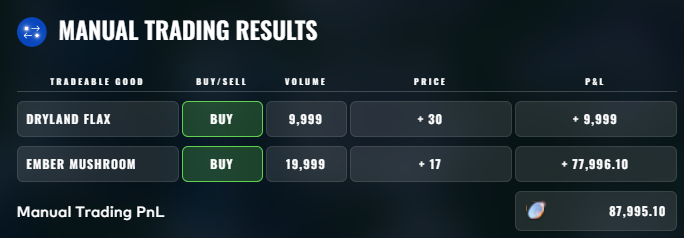

<p align="center">
  
</p>

# Blue Lion Trading — IMC Prosperity 4 Writeup

## Overview

This is a writeup from our team's participation in **IMC Prosperity 4**, an international quantitative trading competition. We finished **256th globally** out of 18,803 teams with a final score of **438,210 XIREC**.

| Category | Result |
|---|---|
| Final Score | 438,210 XIREC |
| Global Rank | 256 / 18,803 |
| Algorithmic PnL | 304,557 XIREC |
| Manual PnL | 133,653 XIREC |

## Team Members

<table>
  <tr>
    <td align="center">
      <br/>
      <a href="https://www.linkedin.com/in/kaikiikeda/">Kaiki Ikeda</a>
    </td>
    <td align="center">
      <br/>
      <a href="https://www.linkedin.com/in/gregory-gwee/">Gregory Gwee</a>
    </td>
    <td align="center">
      <br/>
      Ananya
    </td>
    <td align="center">
      <br/>
      Ansh
    </td>
  </tr>
</table>

---

## Infrastructure & Tooling

### [graphIMC](https://github.com/parkjpd/graphIMC)

We made a local backtester, which served as the primary research and development environment for us. This included visualization dashboards, parameter-sweeping, etc. Every strategy iteration we worked on was through this tool. This was essential to use given the 48 hour rounds where we had to make rapid iterations without waiting on IMC's official platform for insights.

### [prosperity-intel](https://github.com/parkjpd/prosperity-intel)

A Discord intelligence pipeline we built to stay ahead of the field. It ran a selfbot that scraped the official IMC Prosperity Discord 24/7, piped messages into a SQLite database, and used an LLM extractor to surface competitor signals into a digest. This fed directly into our research process across rounds.

---

## Round-by-Round Breakdown

### Round 1 — ASH_COATED_OSMIUM & INTARIAN_PEPPER_ROOT

**Algorithmic PnL:** 95,616 XIREC (PEPPER: 78,020 · OSMIUM: 17,596)

#### ASH_COATED_OSMIUM

Osmium was a textbook mean-reverting product centered around a known fair value of **10,000**. We treated it as a pure market-making problem: take any fill available below fair, sell anything above it, then passively quote on both sides just inside the best bid/ask to capture spread.

The strategy held the position limit (±80) as both a ceiling and a floor, using fallback quotes at 9,993 / 10,003 when the book was thin. No regime detection needed — Osmium never strayed far enough from 10,000 to warrant it.


#### INTARIAN_PEPPER_ROOT

Pepper Root was the more interesting problem. Despite superficial similarity to Osmium, it drifted **~1,000 points** over the course of the day (13,000 → 14,000) — a clean linear trend, not noise.

We built a **4-state regime-switching machine** to detect and exploit this:

| Regime | Trigger | Behavior |
|---|---|---|
| **MM** (default) | Always active on startup | Market-make with long bias, target ~56 units long |
| **LONG_LINEAR** | OLS: R² > 0.90, slope > 0.0003 for 3 consecutive checks | Aggressively accumulate to 76 units long, block all sells |
| **SHORT_LINEAR** | OLS: R² > 0.90, slope < −0.0003 for 3 consecutive checks | Mirror — accumulate short, block all buys |
| **LIQUIDATE** | Safety valve: price > 50 ticks from OLS trend line | Emergency flatten, one-way latch (no return to LINEAR) |

Every **20 ticks** we ran an OLS regression on a rolling **150-tick window** of mid-prices. If R² and slope passed the threshold for 3 consecutive checks, we upgraded from MM to LINEAR. Thresholds were asymmetric by design — **easy to exit LINEAR, hard to enter it** — to avoid false signals on noisy days.

In the LONG_LINEAR regime, take width was dynamic: wider early in the day (more predicted price move remaining), narrowing toward the close. Once Pepper confirmed its uptrend, we locked in at the 80-unit position limit and held it for most of the day.

The `drift_broken` latch ensured that if a safety valve fired mid-trend, we wouldn't re-enter LINEAR and chase a reversal.


**Final positions:** PEPPER +80 · OSMIUM +80 (both maxed long at end of day)

---

#### Manual Challenge — An Intarian Welcome

**Manual PnL: 87,995 XIREC**

The auction offered two products with guaranteed merchant buybacks: **DRYLAND_FLAX** (buyback: 30/unit, no fee) and **EMBER_MUSHROOM** (buyback: 20/unit, −0.10 fee/unit). The mechanic is simple but the decision isn't: submit one limit order (price, quantity), the exchange picks a clearing price that maximizes volume, and you fill at that clearing price regardless of how high you bid. So the only question is — **where will the clearing price land?**

Since you always execute at the clearing price (not your bid), bidding higher than the clearing carries no penalty. The entire game is estimating whether the clearing price will be low enough to leave you a profit after the buyback.

Our approach:
- **DRYLAND_FLAX**: bid at the full buyback price of **30** with max volume. This guaranteed we'd be filled at any clearing price ≤ 30, capturing whatever spread existed. Clearing landed at **29** → +1/unit.
- **EMBER_MUSHROOM**: estimated the field wouldn't push clearing above **16**, leaving room above the 0.10/unit fee. Bid **17** with near-max volume. Clearing landed at **16** → profit of 20 − 16 − 0.10 = **+3.90/unit**.



---

### Round 2 — [Products: e.g. + CROISSANTS, JAMS, DJEMBES, PICNIC_BASKET1/2]

**Products traded:** [list, including carried-over products]

**Strategy overview:**

[Describe the core strategy]

**Key observations:**

- [Observation 1]
- [Observation 2]

**Results:** [PnL or rank for this round]

---

### Round 3 — [Products: e.g. + VOLCANIC_ROCK, VOUCHERS]

**Products traded:** [list]

**Strategy overview:**

[Options pricing, volatility modeling, etc.]

**Key observations:**

- [Observation 1]
- [Observation 2]

**Results:** [PnL or rank for this round]

---

### Round 4 — [Products]

**Products traded:** [list]

**Strategy overview:**

[Describe the core strategy]

**Key observations:**

- [Observation 1]
- [Observation 2]

**Results:** [PnL or rank for this round]

---

### Round 5 — [Products]

**Products traded:** [list]

**Strategy overview:**

[Describe the core strategy]

**Key observations:**

- [Observation 1]
- [Observation 2]

**Results:** [PnL or rank for this round]

---

## Manual Challenges

### Round 1 — [Challenge Name]

[Describe approach and result]

### Round 2 — [Challenge Name]

[Describe approach and result]

### Round 3 — [Challenge Name]

[Describe approach and result]

### Round 4 — [Challenge Name]

[Describe approach and result]

### Round 5 — [Challenge Name]

[Describe approach and result]

---

## Key Takeaways

- [Lesson 1]
- [Lesson 2]
- [Lesson 3]

---

## Repository Structure

```
├── Strategies/
│   ├── Round1/      # Trading algorithms for Round 1
│   ├── Round2/      # Trading algorithms for Round 2
│   ├── Round3/      # Trading algorithms for Round 3
│   ├── Round4/      # Trading algorithms for Round 4
│   └── Round5/      # Trading algorithms for Round 5
├── Analysis/
│   ├── Round1/      # Notebooks and analysis for Round 1
│   ├── Round2/
│   ├── Round3/
│   ├── Round4/
│   └── Round5/
├── Figures/         # Charts, dashboards, visualizations
├── Scores/          # Score screenshots and progression data
└── README.md
```
