<p align="center">
  
</p>

# Blue Lion Trading - IMC Prosperity 4 Writeup

## Overview

This is a writeup from our team's participation in **IMC Prosperity 4**, an international quantitative trading competition. We finished **256th globally** out of 18,803 teams with a final score of **438,210 XIREC**.

| Category | Result |
|---|---|
| Final Score | 438,210 XIREC |
| Global Rank | 256 / 18,803 |
| Algorithmic PnL | 304,557 XIREC |
| Manual PnL | 133,653 XIREC |

## Team Members

<table>
  <tr>
    <td align="center">
      <br/>
      <a href="https://www.linkedin.com/in/kaikiikeda/">Kaiki Ikeda</a>
    </td>
    <td align="center">
      <br/>
      <a href="https://www.linkedin.com/in/gregory-gwee/">Gregory Gwee</a>
    </td>
  </tr>
</table>

## Infrastructure & Tooling

### [graphIMC](https://github.com/parkjpd/graphIMC)

We made a local backtester, which served as the primary research and development environment for us. This included visualization dashboards, parameter-sweeping, etc. Every strategy iteration we worked on was through this tool. This was essential to use given the 48 hour rounds where we had to make rapid iterations without waiting on IMC's official platform for insights.

### [prosperity-intel](https://github.com/parkjpd/prosperity-intel)

A Discord intelligence pipeline we built to stay ahead of the field. It ran a selfbot that scraped the official IMC Prosperity Discord 24/7, piped messages into a SQLite database, and used an LLM extractor to surface competitor signals into a digest. This fed directly into our research process across rounds.

---

## Round-by-Round Breakdown

<details>
<summary><b>Round 1 - ASH_COATED_OSMIUM & INTARIAN_PEPPER_ROOT</b></summary>

**Algorithmic PnL: 95,616 XIREC (PEPPER: 78,020 / OSMIUM: 17,596)** <br>
**Algorithmic Rank: 1600th**

#### ASH_COATED_OSMIUM

Osmium was a textbook mean-reverting product centered around a known fair value of **10,000**. We treated it as a pure market-making problem: take any fill available below fair, sell anything above it, then passively quote on both sides just inside the best bid/ask to capture spread.

The strategy held the position limit (+/-80) as both a ceiling and a floor, using fallback quotes at 9,993 / 10,003 when the book was thin. No regime detection needed - Osmium never strayed far enough from 10,000 to warrant it.


#### INTARIAN_PEPPER_ROOT

Pepper Root was the more interesting problem. Despite superficial similarity to Osmium, it drifted **~1,000 points** over the course of the day (13,000 to 14,000) - a clean linear trend, not noise.

We built a **4-state regime-switching machine** to detect and exploit this:

| Regime | Trigger | Behavior |
|---|---|---|
| **MM** (default) | Always active on startup | Market-make with long bias, target ~56 units long |
| **LONG_LINEAR** | OLS: R^2 > 0.90, slope > 0.0003 for 3 consecutive checks | Aggressively accumulate to 76 units long, block all sells |
| **SHORT_LINEAR** | OLS: R^2 > 0.90, slope < -0.0003 for 3 consecutive checks | Mirror - accumulate short, block all buys |
| **LIQUIDATE** | Safety valve: price > 50 ticks from OLS trend line | Emergency flatten, one-way latch (no return to LINEAR) |

Every **20 ticks** we ran an OLS regression on a rolling **150-tick window** of mid-prices. If R^2 and slope passed the threshold for 3 consecutive checks, we upgraded from MM to LINEAR. Thresholds were asymmetric by design - **easy to exit LINEAR, hard to enter it** - to avoid false signals on noisy days.

In the LONG_LINEAR regime, take width was dynamic: wider early in the day (more predicted price move remaining), narrowing toward the close. Once Pepper confirmed its uptrend, we locked in at the 80-unit position limit and held it for most of the day.

The `drift_broken` latch ensured that if a safety valve fired mid-trend, we wouldn't re-enter LINEAR and chase a reversal.


**Final positions:** PEPPER +80 / OSMIUM +80 (both maxed long at end of day)

---

#### Manual Challenge - An Intarian Welcome

**Manual PnL: 87,995 XIREC** <br>
**Manual Rank: 1st**

The auction offered two products with guaranteed merchant buybacks: **DRYLAND_FLAX** (buyback: 30/unit, no fee) and **EMBER_MUSHROOM** (buyback: 20/unit, -0.10 fee/unit). The mechanic is simple but the decision isn't: submit one limit order (price, quantity), the exchange picks a clearing price that maximizes volume, and you fill at that clearing price regardless of how high you bid. So the only question is -- **where will the clearing price land?**

Since you always execute at the clearing price (not your bid), bidding higher than the clearing carries no penalty. The entire game is estimating whether the clearing price will be low enough to leave you a profit after the buyback.

Our approach:
- **DRYLAND_FLAX**: bid at the full buyback price of **30** with max volume. This guaranteed we'd be filled at any clearing price of 30 or less, capturing whatever spread existed. Clearing landed at **29**, giving us +1/unit.
- **EMBER_MUSHROOM**: estimated the field wouldn't push clearing above **16**, leaving room above the 0.10/unit fee. Bid **17** with near-max volume. Clearing landed at **16**, giving us a profit of 20 - 16 - 0.10 = **+3.90/unit**.


</details>

---

<details>
<summary><b>Round 2 - ASH_COATED_OSMIUM & INTARIAN_PEPPER_ROOT</b></summary>

**Algorithmic PnL: 87,161 XIREC (PEPPER: 82,849 / OSMIUM: 4,312)** <br>
**Algorithmic Rank: 1754th**

Round 2 was the same two products - but with two new wrinkles: a **Market Access Fee (MAF)** bid for extra order flow, and a refinement pass on the algorithm itself.

#### Algorithmic Changes

The core strategies didn't change much, but we added one meaningful improvement: an **asymmetric order book signal**.

We noticed that when one side of the order book was completely empty, prices tended to move in that direction by around 8 points over the next few ticks - consistently enough to trade on. The logic is straightforward: if there are no asks, sellers have stepped away and the price is likely rising. If there are no bids, buyers have stepped away and it's likely falling.

When we detected this:
- **No asks (bullish):** we shifted our sell quotes higher and cut sell size to one-third - no point selling cheap into a rally
- **No bids (bearish):** we shifted our buy quotes lower and cut buy size to one-third - no point buying into a drop

We applied this to both Osmium and Pepper Root.

The other notable change was that Pepper Root now **started in LINEAR mode** immediately instead of waiting for OLS to confirm a trend first. Since Pepper trended upward in Round 1, we assumed it would continue - and it did, drifting from **14,000 to 15,000** over the day.

#### Market Access Fee

We chose **not to bid** for extra market access. The MAF is a blind auction - you pay your bid if you're in the top 50%, but you don't know where the median will land. Given the uncertainty and the fact that our strategy was already capturing most of the available edge, we decided it wasn't worth the risk of overpaying.

---

#### Manual Challenge - Invest & Expand

The manual challenge this round was a budget allocation problem. We had **50,000 XIRECs** to split across three pillars - **Research**, **Scale**, and **Speed** - with a score of `Research x Scale x Speed - Budget Used`.

The catch: Research grows logarithmically (diminishing returns), Scale is linear, and Speed is **rank-based** - meaning your return depends entirely on what everyone else bids, not just your own allocation.

**Our allocation: Research 16% / Scale 50% / Speed 34%**

**Manual PnL: 183,999 XIREC** <br>
**Manual Rank: 139th**

#### How we decided

We built a small optimizer and ran it across six different assumptions ("presets") about how the field would behave:

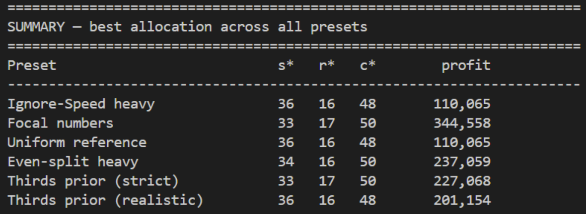

The key insight was that Research has steep diminishing returns - putting 16% there captures most of the value, and anything beyond that barely moves the needle. Scale is linear, so the remaining budget naturally flows there. The real game was **Speed**.

Since Speed is rank-based, we tried to model what other teams would bid. Our best guess was that most teams would either go thirds (33/33/33) or pick round numbers. Bidding 34% would beat the whole 33% cluster outright and land us near the top of the rankings - targeting the 0.9 hit rate multiplier.

#### What actually happened

The field was more aggressive than we expected:

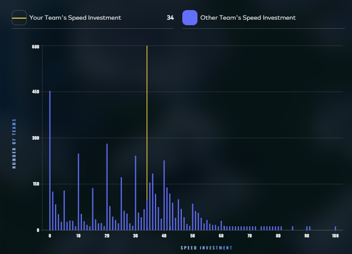

There's a huge spike at 0% (teams that didn't think about Speed at all), but a dense cluster in the 30-45% range that we didn't fully anticipate. With our 34% we ranked **#1913**, which translated to a hit rate of **0.54** - well below the 0.9 we were aiming for.

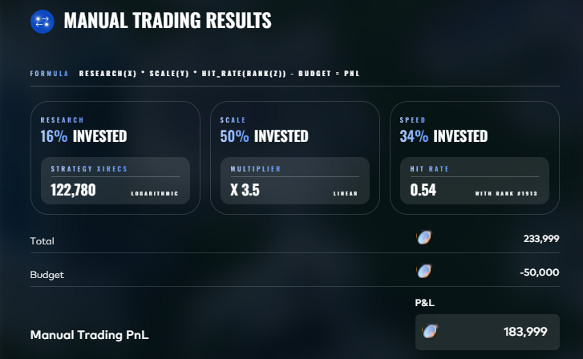

The model was right in its structure but too optimistic on where 34% would rank. In hindsight, a bid of ~40-45% would have placed us meaningfully higher without giving up much on Research or Scale.

</details>

---

<details>
<summary><b>Round 3 - HYDROGEL_PACK, VELVETFRUIT_EXTRACT & VEV Vouchers</b></summary>

**Algorithmic PnL:** 135,147 XIREC (187th) | **Manual PnL:** 67,926 XIREC (535th) | **Round Total:** 203,073 XIREC (204th)

Round 3 marked the start of GOAT - the leaderboard reset to zero, and three entirely new products were introduced: two delta-1 products (`HYDROGEL_PACK`, `VELVETFRUIT_EXTRACT`) and a chain of 10 European call options on VEV with strikes ranging from 4,000 to 6,500. All had TTE of 5 days at round start.

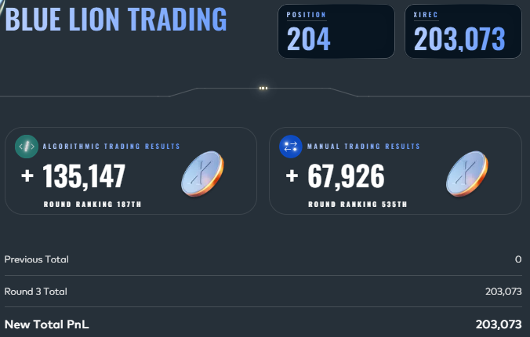

#### Algorithmic Strategy

| Product | Final PnL |
|---|---|
| HYDROGEL_PACK | +23,003 |
| VELVETFRUIT_EXTRACT | +43,440 |
| VEV_4000 | -837 |
| VEV_4500 | -521 |
| VEV_5000 | +21,508 |
| VEV_5100 | +25,460 |
| VEV_5200 | +17,153 |
| VEV_5300 | +5,940 |
| VEV_5400 / 5500 / 6000 / 6500 | ~0 |

##### HYDROGEL_PACK (+23,003 XIREC)

Hydrogel behaved as a mean-reverting product around a pivot of **9,968**. We modeled fair value as an Ornstein-Uhlenbeck process layered with two real-time signals:

- **Book imbalance:** when buy-side volume dominates the top-of-book, we shift fair value downward slightly (IMB_BIAS = -15) to account for adverse selection - an imbalanced book tends to run against passive sellers
- **Impulse pushback:** if the mid price moved sharply in one tick, we applied a small mean-reversion adjustment in the opposite direction (pushback = 30% of the move), effectively fading short-term momentum

Passive quotes were tiered across three price levels (offsets +1/+2/+3 from mid, sizes 50/40/30) to improve fill rates without concentrating risk on a single level.

##### VELVETFRUIT_EXTRACT (+43,440 XIREC)

VEV Extract was also mean-reverting, but with a key wrinkle: we set our fair value anchor **asymmetrically below** the actual sample mean (~5,246-5,255) at **5,240**. This created a deliberate short bias - by treating the product as "expensive" relative to our anchor, we were more aggressive selling high than buying low.

The anchor proved correct: the product drifted from ~5,296 at open to ~5,232 by close, and the short-leaning strategy captured most of that move.

We also added a **bootstrap warmup** for the first 50 ticks: the band threshold was multiplied by 5x during this period to prevent the strategy from trading on an unformed price history and incurring early losses.

##### VEV Vouchers (+68,703 XIREC net)

We built both a **Black-Scholes branch** (complete closed-form European call pricing with per-strike implied volatility estimates) and a **rolling-mean band branch**. We submitted the rolling-mean version.

For each of the 8 active strikes (VEV_4000 through VEV_5500), we maintained a rolling window of mid prices and market-made around the rolling mean with a fixed band of +/-10. The key observations:

- **Deep ITM (VEV_4000, VEV_4500) lost money** - prices track intrinsic value almost exactly, leaving almost no spread to exploit. The rolling mean can't capture meaningful edge when the option price is just `max(spot - strike, 0)`.
- **ATM and near-OTM (VEV_5000-5300) were highly profitable** - these had wide enough spreads and sufficient mean-reversion dynamics to generate consistent edge. VEV_5100 alone contributed +25,460.
- **Deep OTM (VEV_5400-6500) were flat** - prices effectively at zero or one, so there was nothing to trade.

The Black-Scholes branch was kept in the code but disabled. The MR approach was simpler and worked in practice; BS would have required accurate volatility estimates and delta-hedging infrastructure we hadn't built.

A **Type D circuit breaker** forced close-only mode at tick 9,815 (timestamp ~981,500) to lock in unrealized PnL before end-of-day auto-liquidation - avoiding the risk of the matching engine closing positions at unfavorable prices.

---

#### Manual Challenge - The Celestial Gardeners' Guild

**Manual PnL: 67,926 XIREC (535th)**

The setup: trade against a secret pool of counterparties whose reserve prices are uniformly distributed on {670, 675, 680, ..., 920} (51 values, ~1,000 total counterparties). You submit two bids. Bid 1 fills at your bid if it beats a counterparty's reserve. Bid 2 fills at your bid if it beats the reserve **and** your bid exceeds the field average of all second bids, otherwise profit is penalized by `((920 - avg_b2) / (920 - b2))^3`, a cubic penalty that becomes severe as you fall below the field average.

**Our bids:** 755 (Bid 1) / 845 (Bid 2)

| | Bid 1 (755) | Bid 2 (845) |
|---|---|---|
| Accepted | 320 | 376 |
| Rejected | 680 | 624 |
| Margin/unit | 165 | ~40.3 (penalized) |
| P&L | 52,800 | 15,126 |

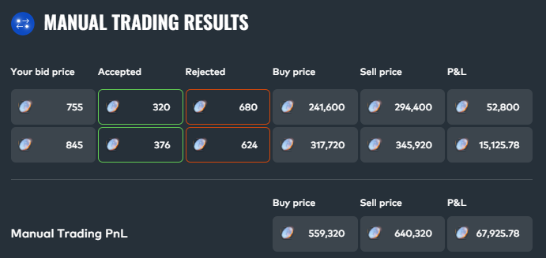

#### How we decided

Because the optimal bid 2 depends entirely on what everyone else bids, we built a simulator to find the EV-maximizing bids under different assumptions about field behaviour. We modelled 8 scenarios:

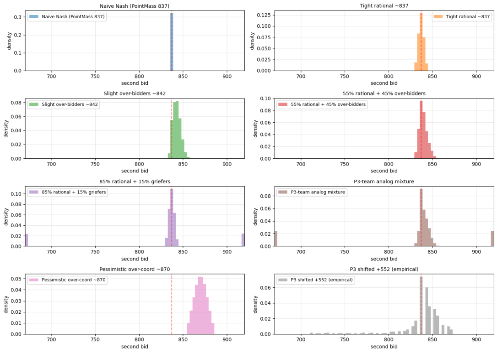

| # | Scenario | b1\* | b2\* | EV\* |
|---|---|---|---|---|
| 0 | Naive Nash (PointMass 837) | 750 | 835 | 85.00 |
| 1 | Tight rational ~837 | 750 | 840 | 84.90 |
| 2 | Slight over-bidders ~842 | 755 | 845 | 84.71 |
| 3 | 55% rational + 45% over-bidders | 755 | 840 | 84.90 |
| 4 | 85% rational + 15% griefers | 750 | 835 | 85.00 |
| 5 | P3-team analog mixture | 750 | 835 | 84.92 |
| 6 | Pessimistic over-coord ~870 | 770 | 870 | 81.27 |
| 7 | P3 shifted +552 (empirical) | 750 | 840 | 84.90 |

The Nash equilibrium for this game (where every team maximises EV assuming everyone else does too) converges to a second bid around **835-840**. Scenarios 0-5 and 7 all landed in that range, with EV tightly clustered around 84.9-85.0. Only the pessimistic over-coordination scenario (scenario 6) pushed the optimum to 870, at a meaningful EV cost (81.3 vs ~85).

We chose **b1=755, b2=845** - matching the "Slight over-bidders ~842" scenario - reasoning that teams would bid slightly above the pure Nash equilibrium as a hedge against being caught below the average.

#### What actually happened

The field averaged 859 on second bids - well above any of our rational-behaviour scenarios, and closer to the pessimistic over-coordination case. Our 845 sat below that average, triggering the cubic penalty:

```
((920 - 859) / (920 - 845))^3 = (61 / 75)^3 = approx. 0.537
```

That cut our effective margin from 75 to ~40/unit. Had we bid 860 (just above the actual avg), unpenalized margin of 60/unit would have outperformed our actual ~40.3/unit.

Bid 1 also came in as the lowest in the entire field (field avg: 768). At 755 we captured reserves 670-750 (~320 counterparties). Matching the field average of 768 would have added roughly 18% more volume at only slightly lower margin.

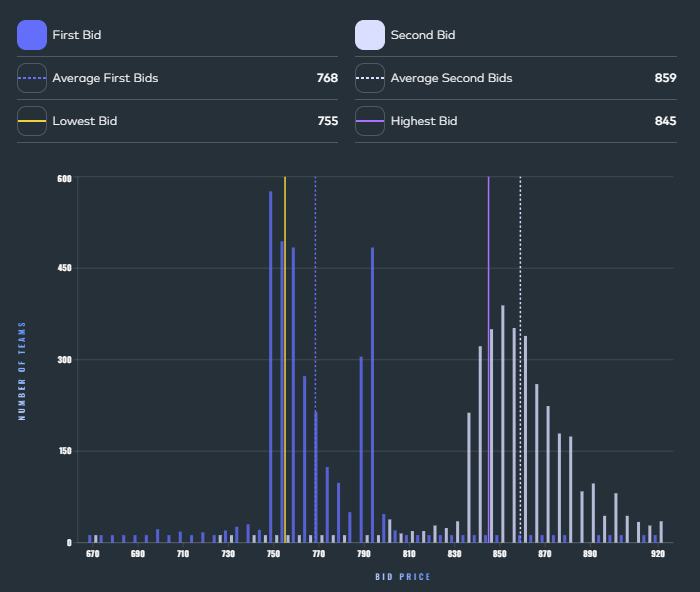

The distribution makes the miss clear: a massive spike at 845-865 for second bids, with our 845 at the bottom of that cluster. Scenario 6 turned out to be closest to reality - but it had also looked like the most pessimistic outlier when we were modelling. In hindsight, the field collectively over-coordinated on high second bids even at the cost of EV, and a bid of ~865 would have sat safely above the average while still maintaining a 55/unit margin.

</details>

---

<details>
<summary><b>Round 4 - HYDROGEL_PACK, VELVETFRUIT_EXTRACT & VEV Vouchers (+ Counterparty Data)</b></summary>

**Algorithmic PnL:** 177,615 XIREC (112th) | **Manual PnL:** -10,518 XIREC (971st) | **Round Total:** 167,098 XIREC (188th)

Same three products as Round 3, but with a major new signal: **counterparty names** are now exposed in every market trade. For the first time, `trade.buyer` and `trade.seller` contain real participant IDs - opening the door to flow analysis, counterparty profiling, and adversarial defense.

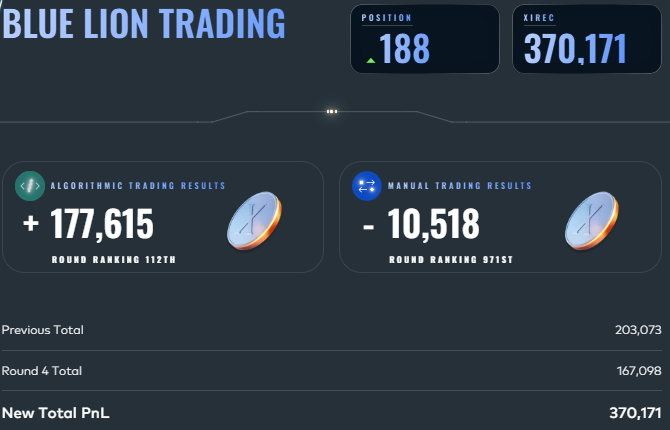

#### Algorithmic Strategy - Static Z-Take (v12)

| Product | Final PnL |
|---|---|
| HYDROGEL_PACK | +51,140 |
| VELVETFRUIT_EXTRACT | +26,693 |
| VEV_4000 | +19,131 |
| VEV_4500 | +26,369 |
| VEV_5000 | +30,963 |
| VEV_5100 | +15,248 |
| VEV_5200 | +12,655 |
| VEV_5300 | -3,006 |
| VEV_5400 | -1,079 |
| VEV_5500 | -497 |
| VEV_6000 / 6500 | 0 (dropped) |

Round 4 was a complete algo rebuild. We replaced Round 3's per-product OU pivots and rolling-mean bands with a single unified framework: **static z-score mean reversion**.

With 4+ days of historical data available, empirical mean/SD estimates are now more reliable than tick-by-tick rolling estimates. The simpler approach also generalises better - a rolling mean chases a drifting product, while a static mean refuses to.

**Base logic (identical for all products):**
- Fit `mean` and `sd` per product from historical data (R3 day + R4 days 1-3)
- Each tick: `z = (mid - mean) / sd`
- `z >= +1.0`: sell into bids at prices >= mean (up to 17 units)
- `z <= -1.0`: buy from asks at prices <= mean (up to 17 units)
- VEV_6000 / VEV_6500 dropped - mid pinned at 0.5, no exploitable spread

**Counterparty-aware modifications:**

| Mod | Status | What it does |
|---|---|---|
| **1.5 - Regime-shift gate** | Active | Tracks rolling 10k-tick window per product. If 85% or more of ticks sit on one side of mean, the static mean has likely drifted - pause z-takes for 5k ticks. Prevents trading against a genuine regime change. |
| **2 - Mark-67 inventory tilt** | Disabled | Mark-67 is a systematic VEV buyer with a measured +1.97 tick forward bias at h=100. Tested as a buy-side tilt but produced regime-dependent results (-10k on the hold-out day). The static z-take already captures the same underlying OU signal. |
| **3 - HG defensive cooldown** | Active | Mark 49 and Mark 22 aggressively compress HYDROGEL spreads just before a directional move. After 7+ ticks of single-sided compression, suppress HG z-takes for 500 ticks to avoid being adversely selected into their wave. |
| **4 - OU extrinsic-short** | Disabled | For far-OTM strikes (5300-5500), the fitted OU stationary distribution implies fair extrinsic is approximately 0, so shorting extrinsic should be profitable. Theory holds over the full 7-day option life but bleeds MtM losses within a single day. |

The key insight on counterparty data: the new information was most valuable **defensively**. Mark-67's flow signal was real but not safely tradeable; Mark 49/22's spread compression was actionable as a cooldown trigger. Using counterparty data to avoid bad trades (Mod 3) contributed more robustly than using it to find good ones (Mod 2).

---

#### Manual Challenge - Vanilla Just Isn't Exotic Enough

**Manual PnL: -10,518 XIREC (971st)**

The challenge offered vanilla puts/calls (2-week and 3-week) plus three exotics on `AETHER_CRYSTAL` (GBM, zero drift, vol = 251% annualised, 4 steps/day). All positions held to expiry; PnL marked against the average fair value across 100 simulations.

We modelled 8 portfolio strategies ranging from aggressive (max exposure) to conservative (single-leg), then chose a position close to **Q2 - High-E (mild risk control)**:

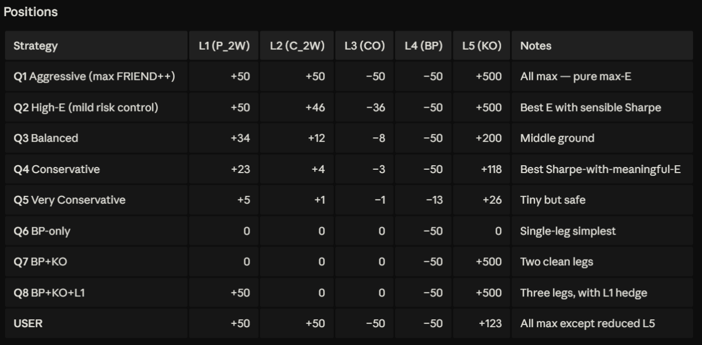

**Submitted positions:**

| Product | Action | Volume | P&L |
|---|---|---|---|
| AC_50_P_2 (3-week put, K=50) | BUY | 50 | -14,120 |
| AC_50_C_2 (3-week call, K=50) | BUY | 46 | -21,567 |
| AC_50_CO (Chooser, K=50) | SELL | 36 | +39,135 |
| AC_40_BP (Binary put, K=40) | SELL | 50 | +15,000 |
| AC_45_KO (Knock-out put, K=45) | BUY | 500 | -28,966 |

**The intended trade:** a chooser option is worth at most `max(call, put)` - by definition you only get to pick one leg. But owning both the put and the call (a straddle) gives you `put + call`. Shorting the chooser while holding both legs should generate the spread between `put + call` and `max(put, call)` = `min(put, call)`. That leg worked: the chooser sale returned +39,135.

**What went wrong:** the knock-out put was the main drag. With 500 contracts at K=45 and a high-vol underlying (251% annual), the knock-out barrier was breached frequently across simulations - most contracts expired worthless, losing -28,966. The KO put's payoff is path-dependent in a way the vanilla put is not; at 251% vol, even a short-dated KO barrier gets hit far more often than intuition suggests.

The binary put sale (+15,000) confirmed the underlying tended to stay above 40 in the simulation average, validating that directional call. But the combination of losing both the put and call positions (suggesting spot ended near the strike in the average) with the heavy KO loss dragged the total to -10,518.

</details>

---

<details>
<summary><b>Round 5 - 50 New Products (Cherry Picking)</b></summary>

**Algorithmic PnL:** -8,205 XIREC (1161st) | **Manual PnL:** +76,245 XIREC (699th) | **Round Total:** 68,040 XIREC (256th overall)

The final round replaced all previous products with 50 brand-new ones across 10 categories of 5, each with a position limit of **10**. The challenge was identification: not all 50 had exploitable structure, and the job was to find the ones that did, fast.

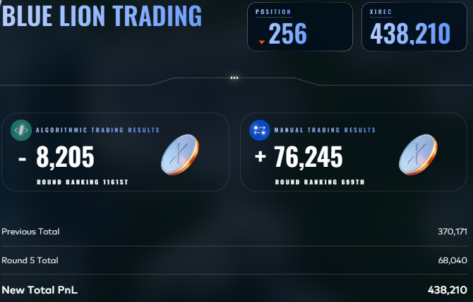

#### Algorithmic Strategy - Multi-Layer Cherry Picking (v11a)

| Product | Strategy | PnL |
|---|---|---|
| OXYGEN_SHAKE_GARLIC | Drift long | +14,693 |
| UV_VISOR_RED | Drift long | +13,744 |
| UV_VISOR_AMBER | Drift short | +6,235 |
| SNACKPACK_VANILLA | EWMA take | +6,043 |
| SNACKPACK_CHOCOLATE | EWMA take | +3,705 |
| SNACKPACK_RASPBERRY | EWMA take | +1,088 |
| MICROCHIP_RECTANGLE | CIRCLE lead-lag | +115 |
| TRANSLATOR_GRAPHITE_MIST | Bollinger MR | -2,760 |
| MICROCHIP_OVAL | Drift short | -2,649 |
| SNACKPACK_PISTACHIO | EWMA take (OBI-gated) | -3,825 |
| SNACKPACK_STRAWBERRY | EWMA take | -3,905 |
| MICROCHIP_TRIANGLE | Bollinger MR | -6,017 |
| MICROCHIP_SQUARE | Bollinger MR | -8,432 |
| SLEEP_POD_NYLON | Bollinger MR | -12,782 |
| PEBBLES_XL | Bollinger MR | -13,456 |

We identified four distinct signal types across the 50 products:

**1 - Drift trades** *(4 products, best performers)*

Four products showed clean, persistent directional trends in historical data: `MICROCHIP_OVAL` and `UV_VISOR_AMBER` drifted down; `UV_VISOR_RED` and `OXYGEN_SHAKE_GARLIC` drifted up. We ran each with a trailing-stop + auto-resume system: maintain the max-position directional bet as long as price stays within `stop` ticks of the best achieved level; flatten and re-enter if the stop triggers then reverses. This was the only consistently profitable strategy on live day (+34,672 combined from RED, GARLIC, AMBER).

**2 - Bollinger Band MR** *(5 products)*

`PEBBLES_XL`, `SLEEP_POD_NYLON`, `MICROCHIP_TRIANGLE`, `TRANSLATOR_GRAPHITE_MIST`, and `MICROCHIP_SQUARE` all showed mean-reverting behaviour in backtests. Each used a rolling window (200-1,500 ticks), entering at |z| >= 2.0-2.5 sigma and exiting when z crosses zero. Hyperparameters were tuned by 3-day cross-validation with a **minimax criterion** - pick parameters where the worst of the three days is highest, requiring all days to be positive. Despite this, all five Bollinger products lost on live day (-43,447 combined), the primary driver of the negative algo result. The live day exposed regime drift that the 3-day backtest hadn't captured.

**3 - EWMA Take** *(5 Snackpacks)*

Each Snackpack used an exponentially-weighted moving average as the fair value estimate (`fair = (1-alpha)*fair + alpha*mid`), taking against the book when the best ask/bid deviated from fair by more than `edge`. Per-product alpha and edge were tuned independently. Pistachio additionally used an order-book imbalance gate to filter wrong-direction trades. Results were mixed: Vanilla and Chocolate were profitable, Pistachio and Strawberry were not (-1,637 net across all five).

**4 - CIRCLE to RECTANGLE lead-lag**

`MICROCHIP_CIRCLE` was observed to lead `MICROCHIP_RECTANGLE` by ~200 ticks. When CIRCLE moved >= 100 ticks over a 200-tick window, we took a directional position in RECTANGLE (up to 5 units). Nearly flat on the day (+115) - the signal was real but small.

---

#### Manual Challenge - Ashflow Alpha (Ignith Exchange)

**Manual PnL: +76,245 XIREC (699th)**

The Ashflow Alpha news source rated 9 Ignith products across direction, novelty, and transmission quality. Our framework:

| Product | Direction | Novelty | Net Assessment |
|---|---|---|---|
| Lava Cake | - | High (lab tests confirmed) | **Strong -** |
| Magma Ink | + | High (sold-out launch) | **Strong +** |
| Scoria Paste | + | High (influencer call) | **Strong +** |
| Ashes of Phoenix | - | High (resurfaced video) | **Mod -** |
| Thermalite Core | + | Low (trend telegraphed) | **Mild +** |
| Volcanic Incense | + | Low (rally in progress) | **Mild +** |
| Pyroflex Cells | - | Low (cancellation known) | **Mild -** |
| Sulfur Reactor | + | High (index inclusion) | **~0 / Mild -** |
| Obsidian Cutlery | - | High (yesterday) | **Mild -** |

The key filter was **novelty vs. transmission**: high-novelty news moves prices only if it flows directly into product demand. Sulfur Reactor's index-inclusion news was high novelty but the equity flow wouldn't reach the physical product market (indirect transmission, roughly zero effect). Obsidian Cutlery's safety news was ambiguous - could read as a supply shock (bullish) or a demand shock (bearish).

**Positions submitted:**

| Product | Action | % | P&L |
|---|---|---|---|
| Lava Cake | SELL | 34% | +59,802 |
| Thermalite Core | BUY | 12% | +12,102 |
| Obsidian Cutlery | BUY | 22% | -26,585 |
| Pyroflex Cells | BUY | 4% | -8,414 |
| Ashes of Phoenix | SELL | 1% | +250 |
| Volcanic Incense / Sulfur / Magma / Scoria | N/A | 0% | 0 |

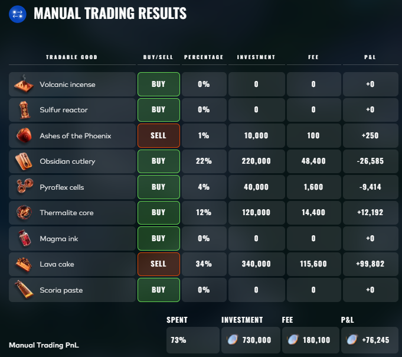

The biggest win was the **Lava Cake short** (+59,802): clear high-novelty negative news with direct consumer demand transmission - exactly the kind of strong, unambiguous signal worth concentrating in despite the quadratic fee (34% allocation = 115,600 fee).

The drag came from **Obsidian Cutlery** (-26,585). We read the ambiguous safety/supply news as potentially bullish for supply scarcity and took a long position, but the bearish consumer demand interpretation won out. The quadratic fee structure made this the most costly mistake - 22% allocation meant the fee alone was 48,400.

Magma Ink and Scoria Paste were rated Strong + but we passed on them (0% allocation). The crowd-influenced return mechanic made the "Strong +" products risky if everyone else also piled in - we judged the fee cost of large positions in consensus trades wasn't worth it. In hindsight that was overly conservative.

</details>

---

## Repository Structure

```
├── Strategies/
│   ├── Round1/      # Trading algorithms for Round 1
│   ├── Round2/      # Trading algorithms for Round 2
│   ├── Round3/      # Trading algorithms for Round 3
│   ├── Round4/      # Trading algorithms for Round 4
│   └── Round5/      # Trading algorithms for Round 5
├── Analysis/
│   ├── Round1/      # Notebooks and analysis for Round 1
│   ├── Round2/
│   ├── Round3/
│   ├── Round4/
│   └── Round5/
├── Figures/         # Charts, dashboards, visualizations
├── Scores/          # Score screenshots and progression data
└── README.md
```
